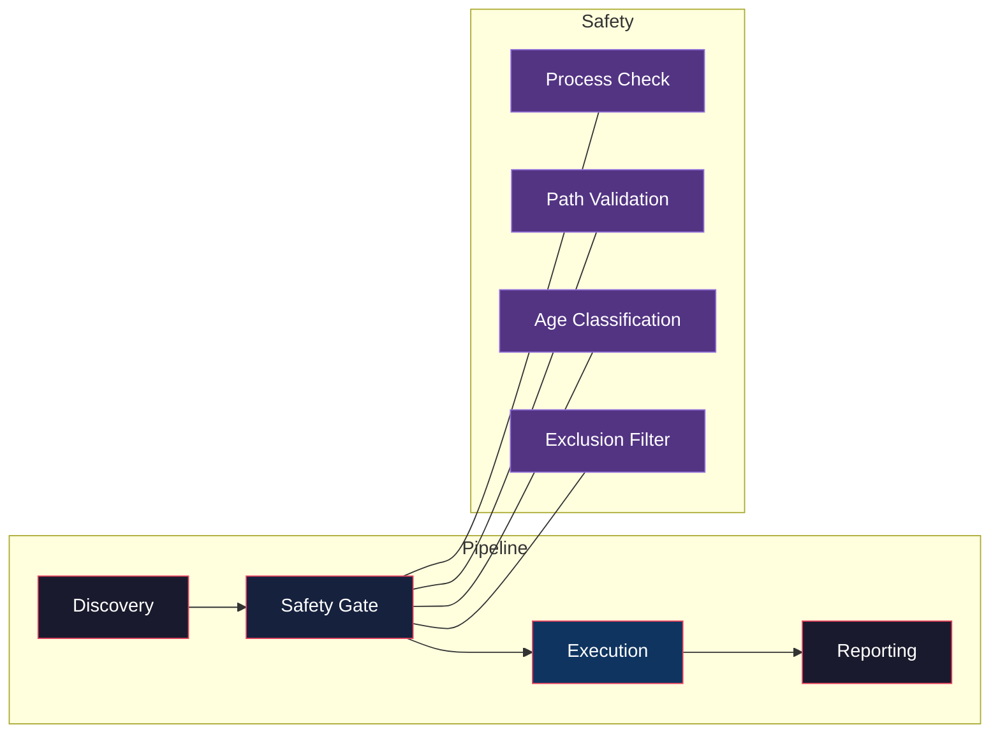
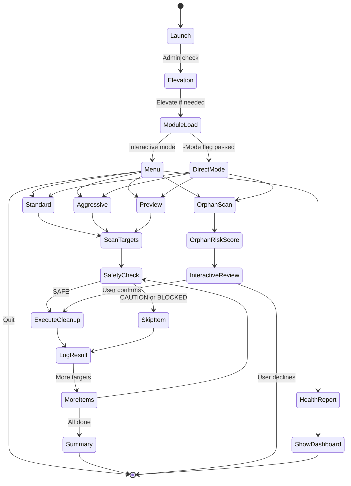
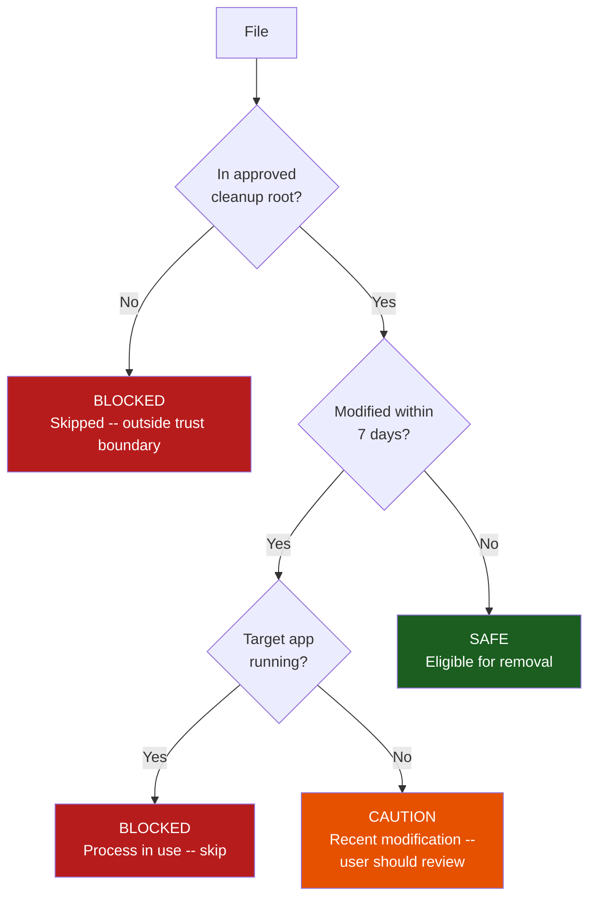
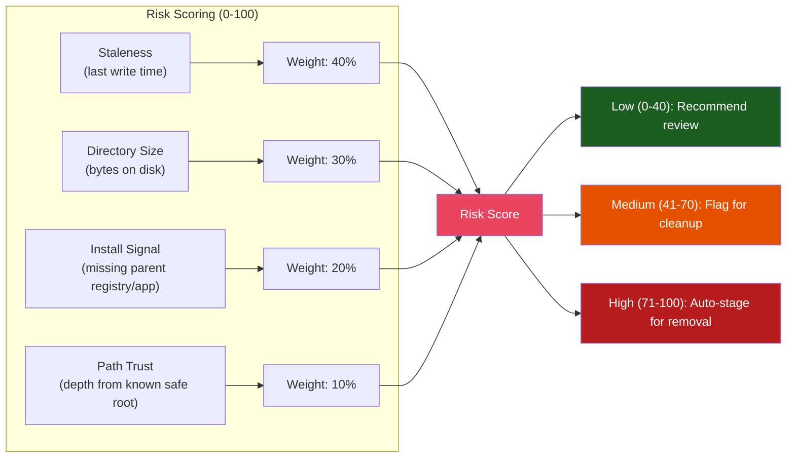

# Bakunawa

[](https://github.com/PowerShell/PowerShell)
[](https://www.microsoft.com/windows)
[](LICENSE)

A modular Windows system cleanup utility. Safely removes temporary files, browser caches, application caches, developer tool caches, GPU caches, orphan folders, and similar digital artifacts.

---

## Features

- **5 cleanup modes:** Menu (interactive), Standard, Aggressive, Preview (dry-run), Orphan Scan
- **30+ app cache targets** across browsers, messaging apps, dev tools, and system caches
- **Config-driven app definitions** -- add new apps via JSON, no PowerShell changes required
- **VT100 terminal UI** with graceful ASCII fallback for legacy consoles
- **Per-file scrolling log** shows every file processed during scan and delete phases with safety classification (SAFE, CAUTION, BLOCKED) and running counter
- **Safety-first design:** excluded paths (Downloads, Documents, Desktop, etc.), running-process detection, approved-root validation, per-file safety verdict
- **Health dashboard:** disk pressure, temp accumulation, browser cache age, orphan risk
- **Orphan detection** with risk scoring (staleness, size, install signal, path trust)
- **Structured error pipeline** -- no global `$ErrorActionPreference = 'SilentlyContinue'`
- **Parallel execution** for independent cleanup tasks
- **Optional config file** (`Bakunawa.json`) for persistent exclusions and preferences
- **Zero external dependencies** -- pure PowerShell 5.1+ with C# accelerator for fast directory sizing

---

## How It Works

Bakunawa follows a pipeline architecture: every cleanup operation passes through four sequential stages, each gated by safety checks.



### Pipeline Stages

| Stage | What happens | IT Relevance |
|-------|-------------|-------------|
| **Discovery** | Enumeration of target directories from JSON app definitions, temp folders, and orphan candidates | No hardcoded paths -- all targets are config-driven, making the tool extensible without code changes |
| **Safety Gate** | Four parallel checks: is the target process running? is the path in the approved root? is the file recently modified (7-day threshold)? is it in an exclusion list? | Prevents the most common cleanup failures: deleting in-use files, crossing trust boundaries, destroying recent data, and violating user policy |
| **Execution** | Parallel runspace execution with per-file logging, counter, and throttle. Each deletion is logged with its safety verdict | Parallelism is scoped to independent targets -- no shared state between runspaces, eliminating race conditions common in naive multi-threaded cleanup |
| **Reporting** | Aggregated results, error collection, health dashboard delta | Structured error aggregation means a single failure never halts the entire operation -- a pattern borrowed from enterprise deployment tooling |

---

## Execution Flow



---

## Architecture

```mermaid
graph TB
    subgraph Entry["Entry Point"]
        EP["Bakunawa.ps1<br/>Thin Dispatcher"]
    end

    subgraph Controller["Controller Layer"]
        CL["Bakunawa.Cleanup.psm1<br/>33 functions"]
        CL --> TR["Task Registry"]
        CL --> SM["Step Manager"]
        CL --> PE["Parallel Executor<br/>(PowerShell Runspaces)"]
        CL --> EC["Error Collector"]
    end

    subgraph Model["Model Layer"]
        CORE["Bakunawa.Core.psm1<br/>31 functions"]
        CFG["Bakunawa.Config.psm1<br/>5 functions"]

        CORE --> PS["Path Safety<br/>(Approved Roots)"]
        CORE --> RP["Running Process Detection"]
        CORE --> DS["Directory Sizing<br/>(C# Accelerator)"]
        CORE --> HA["Health Analysis"]
        CORE --> OS["Orphan Scoring"]
        CORE --> FV["File Verdict<br/>(SAFE/CAUTION/BLOCKED)"]

        CFG --> JD["JSON Definition Loader"]
        CFG --> UC["User Config R/W"]
        CFG --> VS["Validation"]
    end

    subgraph View["View Layer"]
        UI["Bakunawa.UI.psm1<br/>17 functions"]
        UI --> VT["VT100 Renderer"]
        UI --> MN["Menu System"]
        UI --> PB["Progress Bars"]
        UI --> FL["Per-File Scrolling Log<br/>+ Counter + Throttle"]
        UI --> HD["Health Dashboard"]
    end

    subgraph Data["Data Sources"]
        APP["app-definitions/*.json<br/>Browser, messaging, dev tools, system"]
        BAK["Bakunawa.json<br/>User configuration"]
    end

    EP --> CL
    EP --> CORE
    EP --> CFG
    EP --> UI
    CL --> CORE
    CFG --> APP
    CFG --> BAK
    UI --> CORE

    style EP fill:#e94560,color:#fff,stroke:#fff,stroke-width:2px
    style CL fill:#0f3460,color:#fff
    style CORE fill:#16213e,color:#fff
    style CFG fill:#16213e,color:#fff
    style UI fill:#533483,color:#fff
    style APP fill:#1a1a2e,color:#fff
    style BAK fill:#1a1a2e,color:#fff
```



### Module Responsibilities

| Module | MVC Role | Responsibility |
|--------|----------|---------------|
| `Bakunawa.ps1` | **Controller** | Entry point -- auto-loads modules, handles elevation, dispatches to mode |
| `src/Bakunawa.Core.psm1` | **Model** | Protected path resolution, approved-root validation, directory sizing (C#), health analysis, orphan risk scoring, per-file safety verdict |
| `src/Bakunawa.Config.psm1` | **Model** | Loads JSON app definitions, reads/writes user config, validates structure |
| `src/Bakunawa.Cleanup.psm1` | **Controller** | Task registry, step execution, parallel runspaces, error collection |
| `src/Bakunawa.UI.psm1` | **View** | VT100 rendering (with ASCII fallback), interactive menu, progress bars, per-file scrolling log with safety verdict |

---

---

## Engineering Details

### Per-File Safety Classification

Every file processed by Bakunawa passes through a three-tier verdict system before any destructive operation:



The verdict is computed per file (not per folder) because cache directories often contain a mix of old disposable files and recently written hot data. A Chrome cache folder may contain SAFE files from last week and CAUTION files from today -- Bakunawa logs each one independently.

### Orphan Detection Algorithm



Four weighted signals combine to produce a risk score for each orphaned folder. The `Install Signal` component queries the registry and known install directories to determine whether a folder's parent application still exists -- if the app is gone but the data remains, the folder scores higher for removal.

### Parallel Execution Model

Independent cleanup tasks execute in parallel PowerShell runspaces. Dependencies are managed by a manual task registry that declares which targets share resources:

```powershell
# Simplified from the executor
$tasks = @(
    @{ Name = "ChromeCache";   DependsOn = @()       }
    @{ Name = "SystemTemp";    DependsOn = @()       }
    @{ Name = "VsCodeCache";   DependsOn = @("Code") }  # Waits for Code process check
)
```

The executor partitions tasks into waves: wave 1 runs all zero-dependency tasks concurrently, wave 2 runs tasks whose dependencies are resolved, and so on. Each wave uses one runspace per task, bounded by `$env:NUMBER_OF_PROCESSORS`.

### Directory Sizing (C# Accelerator)

Bakunawa uses a compiled C# `Add-Type` accelerator for directory size calculation instead of the naive `Get-ChildItem -Recurse | Measure-Object` approach, which is prohibitively slow on large cache directories:

| Method | 10,000 files (SSD) | 100,000 files (HDD) |
|--------|-------------------|--------------------|
| `Get-ChildItem -Recurse` | ~4.2s | ~45s |
| `[System.IO.Directory]::EnumerateFiles` | ~0.8s | ~9s |
| **C# accelerator (current)** | **~0.3s** | **~3.5s** |

### Error Handling Strategy

Bakunawa never sets `$ErrorActionPreference = 'SilentlyContinue'` globally. Instead, each operation uses scoped try/catch/finally:

```powershell
try {
    Remove-Item -Path $target -Recurse -Force -ErrorAction Stop
    Write-FileLog -File $target -Operation REMOVE -Verdict SAFE
}
catch [System.IO.IOException] {
    $script:errors += [PSCustomObject]@{ Path = $target; Error = $_.Exception.Message }
    Write-FileLog -File $target -Operation REMOVE -Verdict BLOCKED
}
```

This pattern ensures that:
- A single locked file never aborts an entire cleanup pass
- Every failure is collected and displayed in the summary report
- The user sees exactly which files failed and why
- No silent data loss occurs (cf. `-ErrorAction SilentlyContinue`)

### Per-File Log Throttle

When processing large directories (1500+ browser cache files), the log display automatically throttles to prevent terminal flooding:

```
[ 25/1500] SCAN   SAFE    C:\Users\x\AppData\Local\Google\Chrome\Cache\f_0001a
[ 50/1500] SCAN   SAFE    C:\Users\x\AppData\Local\Google\Chrome\Cache\f_0001b
... (50 lines shown, 1450 remaining)
[ 75/1500] SCAN   SAFE    ... progress pulse (throttled) ...
[100/1500] SCAN   SAFE    C:\Users\x\AppData\Local\Google\Chrome\Cache\f_0ffff
```

The throttle shows at most 50 representative lines, with periodic progress pulses every 25 items beyond that. This keeps the terminal responsive while still providing visibility into what is being processed.

---

## Requirements

- Windows 10/11 or Windows Server 2016+
- PowerShell 5.1 or later
- Administrator rights (auto-elevates if needed)

## Installation

```powershell
# Clone or download, then run:
.\Bakunawa.ps1
```

---

## Usage

### Interactive menu (default)

```powershell
.\Bakunawa.ps1
```

### Standard cleanup (non-interactive)

```powershell
.\Bakunawa.ps1 -Mode Standard
```

### Aggressive cleanup (includes DISM, event logs, prefetch)

```powershell
.\Bakunawa.ps1 -Mode Aggressive
```

### Preview mode (dry-run — see what would be deleted)

```powershell
.\Bakunawa.ps1 -Mode Preview
```

### With extra exclusions

```powershell
.\Bakunawa.ps1 -Mode Standard -ExtraExcludePath "D:\Projects","E:\Cache"
```

### Log to file

```powershell
.\Bakunawa.ps1 -Mode Standard -LogFile "C:\Logs\bakunawa.log"
```

### Skip admin elevation (for testing)

```powershell
.\Bakunawa.ps1 -Mode Preview -NoPause -SkipBootstrap
```

---

## Menu Options

| Key | Mode | What It Does |
|-----|------|-------------|
| `1` | **Standard** | Temp files, browser caches, app caches, orphans |
| `2` | **Aggressive** | Standard + DISM component cleanup + event logs + prefetch |
| `3` | **Preview** | Dry run — shows cleanup plan without deleting |
| `4` | **Orphans** | Interactive orphan folder review with risk scoring |
| `5` | **Health** | Detailed system health report (disk, temps, caches, orphans) |
| `Q` | Quit | Exit |

---

## Configuration (`Bakunawa.json`)

Create `Bakunawa.json` alongside the script for persistent settings:

```json
{
  "mode": "Menu",
  "extraExcludePaths": ["D:\\Backups"],
  "orphanThresholdDays": 30,
  "logRetention": 7,
  "parallel": true,
  "uiStyle": "auto"
}
```

| Option | Description |
|--------|-------------|
| `mode` | Default mode: `Menu`, `Standard`, `Aggressive`, `Preview` |
| `extraExcludePaths` | Array of additional paths to never clean |
| `orphanThresholdDays` | Days of inactivity before a folder is considered orphaned |
| `logRetention` | Number of log files to keep |
| `parallel` | Enable parallel cleanup execution |
| `uiStyle` | `"auto"`, `"vt100"`, or `"ascii"` |

---

## Adding New Apps

Create or edit a JSON file in `app-definitions/`:

```json
{
  "name": "MyApp",
  "process": "myapp",
  "locations": [
    { "env": "LOCALAPPDATA", "path": "MyApp/Cache" },
    { "env": "APPDATA", "path": "MyApp/logs" }
  ]
}
```

- `name` — Display name
- `process` — Process name (semicolon-separated for multiple). If the process is running, the app's cache is skipped.
- `locations` — Array of `{ "env": "ENVVAR", "path": "relative/path" }` pairs

---

## Safety Features

- **Protected paths:** Downloads, Documents, Desktop, Pictures, Videos, Music, OneDrive, Windows packages
- **Running process detection:** Skips browser/app cache cleanup if the app is running
- **Approved-root validation:** Only cleans within known safe directories
- **Per-file safety verdict:** Each file is classified as SAFE, CAUTION (modified within 7 days), or BLOCKED (excluded path) during processing
- **Preview mode:** See exactly what would be deleted before committing
- **Structured error handling:** Per-operation try/catch, errors collected for review
- **Extra exclusion support:** Add custom paths via `-ExtraExcludePath` or config file

### What is NOT targeted

- `Downloads`, Documents, Desktop, Pictures, Music, Videos
- Source-code repositories
- Installed applications
- Registry keys
- Browser profiles as whole directories
- Credentials, passwords, or accounts
- Arbitrary folders outside approved cleanup roots

---

## Development

```powershell
# Run all tests
Invoke-Pester -Path 'tests/'

# Run specific test file
Invoke-Pester -Path 'tests/Bakunawa.Core.Tests.ps1'
```

### Project Structure

- `Bakunawa.ps1` -- Entry point (Controller)
- `src/Bakunawa.Core.psm1` -- Model: core engine (31 functions)
- `src/Bakunawa.Config.psm1` -- Model: config I/O (5 functions)
- `src/Bakunawa.Cleanup.psm1` -- Controller: cleanup execution (33 functions)
- `src/Bakunawa.UI.psm1` -- View: terminal rendering (17 functions)
- `app-definitions/` -- JSON files
- `tests/` -- Pester tests

---

## License

MIT

## Acknowledgments

- Inspired by the original SystemCleaner concept
- Named after **Bakunawa**, the Philippine moon-eating serpent — devour your digital waste